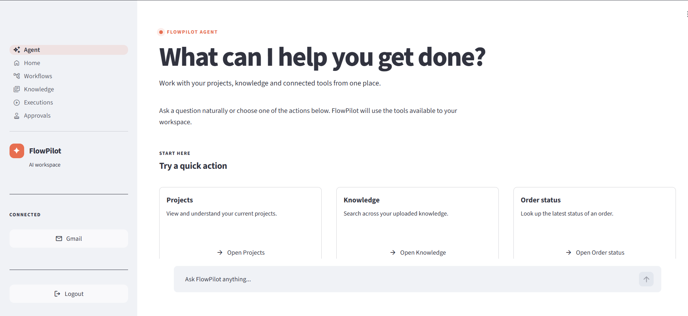
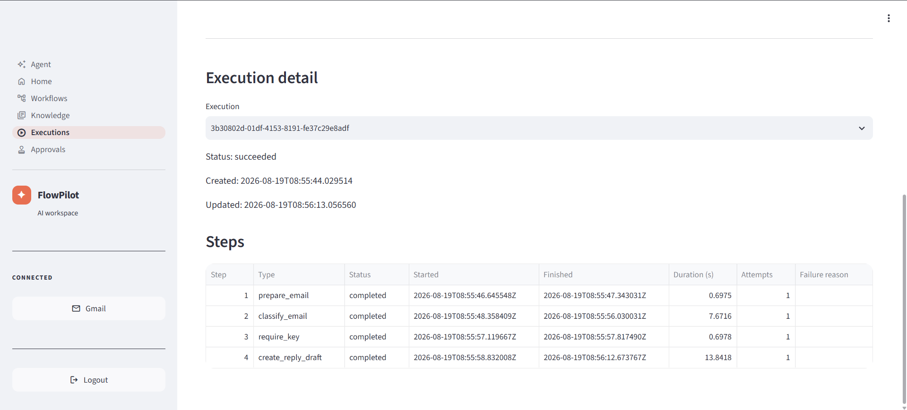
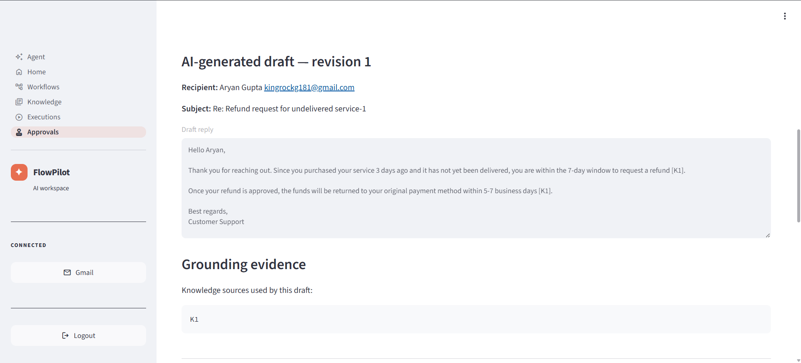

# FlowPilot AI — Production AI Workflow Automation

FlowPilot AI is a production-oriented **AI workflow automation platform** that connects Gmail, asynchronous workflows, Retrieval-Augmented Generation (RAG), and human approval into one reliable system.

It can ingest an incoming email, classify the request, retrieve supporting knowledge, generate a grounded reply, pause for human approval, and send the approved response — with retries, idempotency, audit trails, and an explicit `needs_knowledge` outcome when the knowledge base cannot support an answer.

**🔗 Live demo:** https://flowpilot-ai.site/

**💻 Code:** https://github.com/thearyangupta/flowpilot-ai

> ⏳ First load may take a few seconds while the service wakes from idle.

---




## Try the Live Demo

1. Download [`demo/Refund-Policy.txt`](demo/Refund-Policy.txt).
2. Upload it in the **Knowledge** section.
3. Connect Gmail and create a Gmail automation workflow.
4. Send this test email to the connected inbox:

   **Subject:** Refund request for undelivered service

   **Body:**

   I purchased the service 3 days ago, but it has not been delivered yet.

   I would like to request a refund.

   My order number is FP-TEST-1001.

5. FlowPilot retrieves the refund policy and creates a grounded reply draft.
6. Review it in **Approvals**, then approve it to send the Gmail reply.

To test hallucination control, send a question not covered by the document:

> Do you offer a 20% student discount?

FlowPilot should return `needs_knowledge` instead of inventing an answer.

---

## What it does

- Automates Gmail-based support workflows with durable background processing.
- Classifies incoming emails and generates grounded responses using RAG.
- Uses **hybrid pgvector + PostgreSQL Full-Text Search** with Reciprocal Rank Fusion (RRF).
- Returns `needs_knowledge` instead of inventing unsupported answers.
- Requires **human approval before an AI-generated Gmail reply is sent**.
- Records workflow events, draft revisions, approvals, sends, and audit history.

## Architecture

```text
Gmail
  ↓
Celery Beat
  ↓
Redis
  ↓
Celery Worker
  ↓
Workflow Engine
  ↓
AI Classification
  ↓
Hybrid Knowledge Retrieval
(pgvector + Full-Text Search + RRF)
  ↓
Grounded Gemini Response
  ↓
Human Approval
  ↓
Gmail Send
```

- **Backend:** FastAPI, SQLAlchemy, PostgreSQL, Alembic
- **Async:** Redis, Celery, Celery Beat
- **AI / RAG:** Google Gemini on Vertex AI, pgvector, PostgreSQL Full-Text Search
- **Retrieval:** vector + keyword search fused using **Reciprocal Rank Fusion (RRF)**
- **Auth & Integrations:** JWT, Google OAuth 2.0, PKCE, Gmail API
- **Frontend:** Streamlit
- **Deployment:** Docker, Google Cloud Run, Cloud Run Worker Pools, Artifact Registry, Secret Manager


## Workflow in Action

### Durable Workflow Execution



Each execution exposes its backend steps, status, duration, attempts, and failure information for operational visibility.

### Grounded Draft & Human Approval



AI-generated replies include grounding evidence and remain behind a human approval gate before Gmail sending.

## Reliability & Safety

FlowPilot is built around production-oriented backend and AI engineering patterns:

- idempotent execution requests
- retries with exponential backoff and jitter
- checkpoint recovery and stale-execution recovery
- Gmail ingestion deduplication
- encrypted OAuth credential storage
- tenant-isolated knowledge retrieval
- structured AI outputs and citation validation
- explicit refusal when supporting knowledge is insufficient
- human approval and worker-side revalidation before sending
- execution events and reply-draft audit trails

## RAG Pipeline

```text
Knowledge document
   ↓
chunking
   ↓
Gemini embeddings
   ↓
PostgreSQL + pgvector
   ↓
vector search + full-text search
   ↓
RRF ranking
   ↓
bounded grounded context
   ↓
Gemini generation
   ↓
citation validation
   ↓
GROUNDED / NEEDS_KNOWLEDGE
```

Retrieval quality is evaluated using versioned golden cases, including **Recall@k, citation validity rate, unsupported refusal rate, and p50/p95 retrieval latency**.

## Production E2E Flow

The deployed system has been verified with a real Gmail workflow:

```text
Incoming support email
        ↓
Gmail polling
        ↓
Workflow execution
        ↓
Knowledge retrieval
        ↓
Grounded AI reply
        ↓
Pending human approval
        ↓
Approved
        ↓
Gmail API send
        ↓
Reply delivered
        ↓
created → approved → sent audit trail
```

## Testing

FlowPilot includes automated tests for AI providers, workflow execution, Gmail automation, API behavior, knowledge retrieval, and production-facing reliability paths.

```bash
pytest -q
```

## Project Structure

```text
flowpilot-ai/
│
├── app/
│   ├── ai/          # Gemini providers, agent model and structured outputs
│   ├── api/         # FastAPI routes
│   ├── core/        # configuration, auth and encryption
│   ├── domain/      # workflow engine and step registry
│   ├── evaluation/  # RAG evaluation
│   ├── models/      # SQLAlchemy models
│   ├── services/    # Gmail, workflow and knowledge services
│   └── worker/      # Celery tasks and scheduled jobs
│
├── deployment/      # Cloud Run worker-pool deployment
├── tests/           # AI, workflow, Gmail and knowledge tests
├── ui/              # Streamlit application
├── Dockerfile
├── docker-compose.yml
└── requirements.txt
```

## Run Locally

```bash
git clone https://github.com/thearyangupta/flowpilot-ai.git
cd flowpilot-ai

python -m venv venv
venv\Scripts\activate

pip install -r requirements.txt
alembic upgrade head
```

Start the API:

```bash
uvicorn app.main:app --reload
```

Start Celery:

```bash
celery -A app.worker.celery_app worker --pool=solo --loglevel=info
celery -A app.worker.celery_app beat --loglevel=info
```

Run tests:

```bash
pytest -q
```

## Tech Stack

**Python · FastAPI · PostgreSQL · pgvector · Redis · Celery · Google Gemini · Vertex AI · Gmail API · OAuth 2.0 · Streamlit · Docker · Google Cloud Run**

---

Built to explore production-grade **AI systems, workflow reliability, RAG, human-in-the-loop automation, and cloud deployment** end to end.
